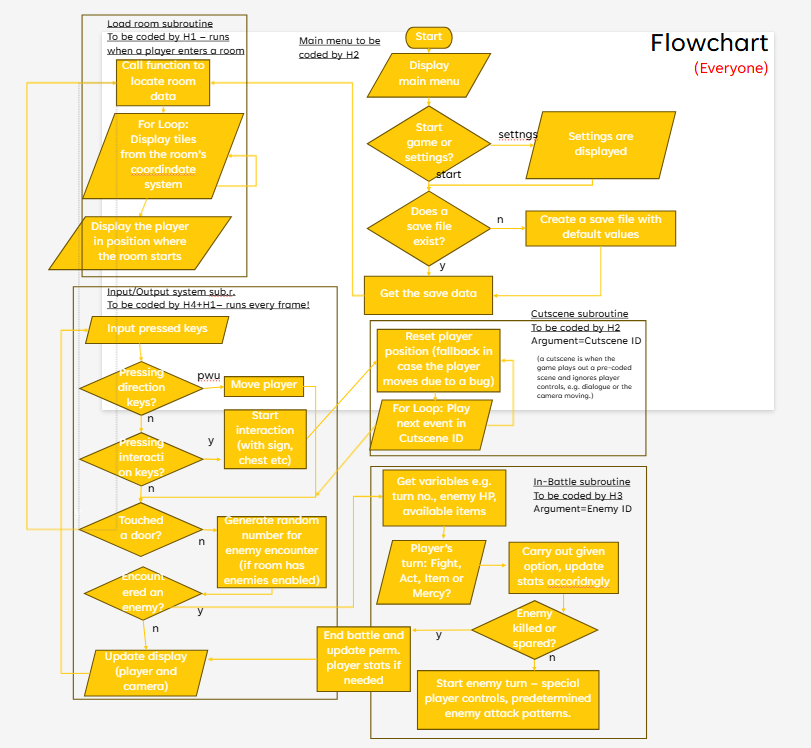

# game
BINIMUM GAME

[kanban](https://github.com/orgs/Binimum-Game-Studios/projects/1/views/1)

Can we please all:

- Create our own branch
- Work on that branch
- When a change is done, use the [kanban](https://github.com/orgs/Binimum-Game-Studios/projects/1/views/1) and create a PR

Many thanks

## Flowchart

